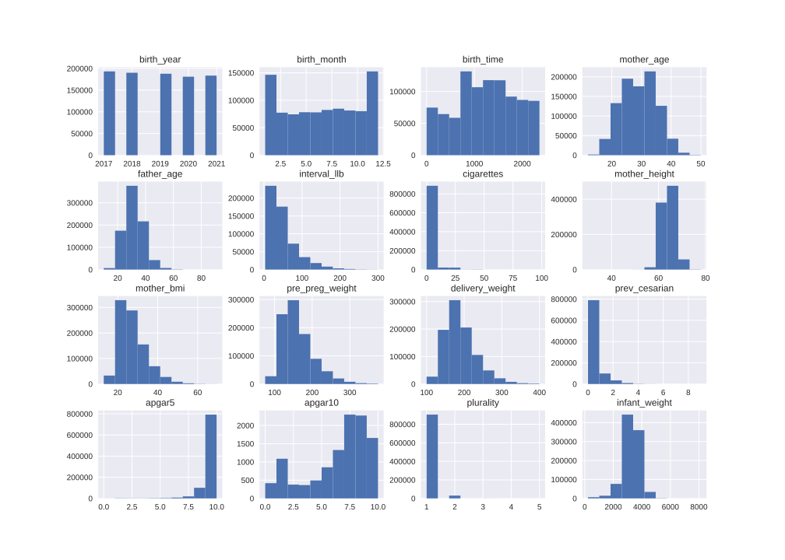
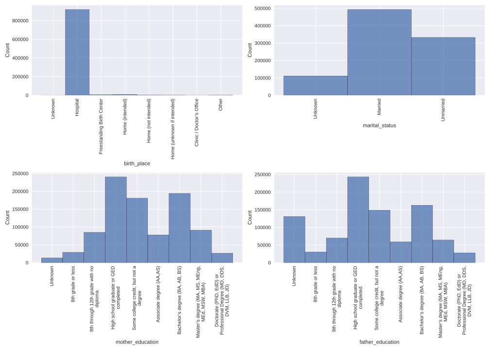
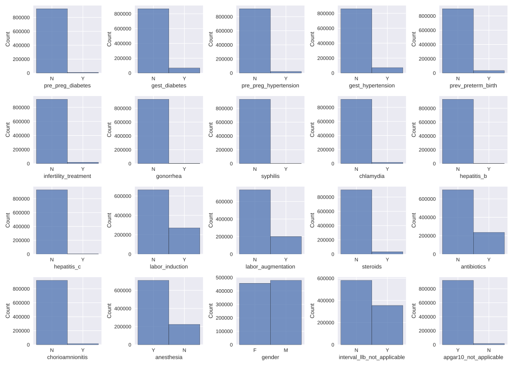

# Big-Biomedical-Data-Lab

### Brief description
CDC - NCHS (National Center for Health Statistics) collected the data, 
In this file, a description of all births in the United States (file per year)  
is provided, as well as the demographic data of the mother and father, 
the health condition of the mother, pre-pregnancy, during and post-pregnancy,  
and the state of the baby at birth. 

### Variables
Based on the pre-processing function provided, 39 variables are returned, including the ID variable.  
I added two more variables to my process (for better, cleaner variables).  
There are many more variables in the original file,  
some of which are derivatives of other variables (such as binning the mother's age)  
and some of which the pre-processing function did not return at all (such as the race of the father).

### Changes
I added auxiliary variables to interval_llb and the apgar10,  
The auxiliary variable specifies if the variable is not applicable,  
and if so, delete the value from the variable (it is the value for not applicable).  
The advantage of this is that now the variable is truly continues / ordinarily and not something undefined.  
Moreover, there were a few mistakes that I fixed in the given pre-processing function, in the cesarian variable and in the infant weight.

### Variables Type
**Continues variables are:**
* birth_year
* birth_month
* birth_time
* mother_age
* father_age
* interval_llb
* cigarettes
* mother_height
* mother_bmi
* pre_preg_weight
* delivery_weight
* prev_cesarian
* apgar5
* apgar10
* plurality
* infant_weight

|index|birth\_year|birth\_month|birth\_time|mother\_age|father\_age|interval\_llb|cigarettes|mother\_height|mother\_bmi|pre\_preg\_weight|delivery\_weight|prev\_cesarian|apgar5|apgar10|plurality|infant\_weight|
|---|---|---|---|---|---|---|---|---|---|---|---|---|---|---|---|---|
|count|935684\.0|935684\.0|935579\.0|935684\.0|825927\.0|550965\.0|931341\.0|930762\.0|914929\.0|917537\.0|922821\.0|934394\.0|931847\.0|11150\.0|935684\.0|934901\.0|
|mean|2018\.9694693935132|6\.572165389169848|1227\.48285820866|29\.113368402152865|31\.857908749804764|49\.51137368072382|0\.9987544841255781|64\.11214897041349|27\.3355459276075|160\.01024481846508|189\.29114638700247|0\.22037812742804427|8\.77533114341732|5\.955874439461883|1\.033960183138752|3256\.7741472091698|
|std|1\.4163924271758752|3\.411941449616828|631\.7827883076669|5\.805057817788305|6\.7942096779540595|38\.05172760684457|4\.557609062710732|2\.8420310656955743|6\.805181286318688|42\.147936626932015|41\.69171363313234|0\.5878079149983872|0\.8247042279671204|2\.700300296303309|0\.18637882130827818|588\.7823891858205|
|min|2017\.0|1\.0|0\.0|12\.0|10\.0|3\.0|0\.0|30\.0|13\.0|75\.0|100\.0|0\.0|0\.0|0\.0|1\.0|227\.0|
|25%|2018\.0|4\.0|758\.0|25\.0|27\.0|24\.0|0\.0|62\.0|22\.3|130\.0|160\.0|0\.0|9\.0|5\.0|1\.0|2955\.0|
|50%|2019\.0|7\.0|1236\.0|29\.0|32\.0|37\.0|0\.0|64\.0|25\.8|150\.0|182\.0|0\.0|9\.0|7\.0|1\.0|3295\.0|
|75%|2020\.0|9\.0|1732\.0|33\.0|36\.0|63\.0|0\.0|66\.0|30\.9|180\.0|211\.0|0\.0|9\.0|8\.0|1\.0|3628\.0|
|max|2021\.0|12\.0|2359\.0|50\.0|91\.0|300\.0|98\.0|78\.0|69\.5|375\.0|400\.0|9\.0|10\.0|10\.0|5\.0|8136\.0|

*Table1 - describe continues variables*

**Categorical variables are:**
* birth_place
* marital_status
* mother_education
* father_education

|index|birth\_place|marital\_status|mother\_education|father\_education|
|---|---|---|---|---|
|count|935684|935684|935684|935684|
|unique|8|3|9|9|
|top|Hospital|Married|High school graduate or GED completed|High school graduate or GED completed|
|freq|918193|492563|240215|242924|

*Table2 - describe categorical variables*

**Binary variables are:**
* pre_preg_diabetes
* gest_diabetes
* pre_preg_hypertension
* gest_hypertension
* prev_preterm_birth
* infertility_treatment
* gonorrhea
* syphilis
* chlamydia
* hepatitis_b
* hepatitis_c
* labor_induction
* labor_augmentation
* steroids
* antibiotics
* chorioamnionitis
* anesthesia
* gender
* interval_llb_not_applicable
* apgar10_not_applicable

|index|pre\_preg\_diabetes|gest\_diabetes|pre\_preg\_hypertension|gest\_hypertension|prev\_preterm\_birth|infertility\_treatment|gonorrhea|syphilis|chlamydia|hepatitis\_b|hepatitis\_c|labor\_induction|labor\_augmentation|steroids|antibiotics|chorioamnionitis|anesthesia|gender|interval\_llb\_not\_applicable|apgar10\_not\_applicable|
|---|---|---|---|---|---|---|---|---|---|---|---|---|---|---|---|---|---|---|---|---|
|count|934658|934658|934658|934658|934658|934658|932921|932921|932921|932921|932921|934948|935084|935084|935084|935084|935084|935684|935684|935684|
|unique|2|2|2|2|2|2|2|2|2|2|2|2|2|2|2|2|2|2|2|2|
|top|N|N|N|N|N|N|N|N|N|N|N|N|N|N|N|N|Y|M|N|Y|
|freq|925508|867863|913304|862180|901129|915771|929877|931518|915762|930993|928470|663992|733609|901260|698586|920179|710548|478578|581393|920031|

*Table3 - describe binary variables*

### EDA and graphs

**Histograms of all the continues variables**

*Figure1 - continues histogram*

**Histograms of all the categorical variables**

*Figure1 - categorical histogram*

**Histograms of all the binary variables**

*Figure1 - binary histogram*
